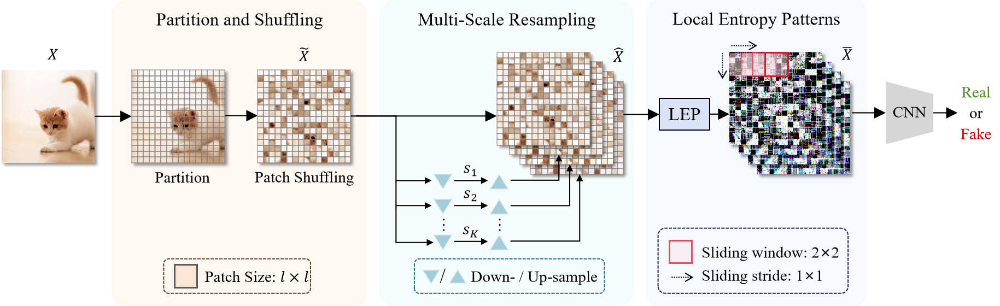

# MLEP
Official github repository for the article [MLEP: Multi-granularity Local Entropy Patterns for Generalized Al-generated lmage Detection](https://arxiv.org/abs/2504.13726).



## Environment Setup
```sh
conda env create -f environment.yaml
```
Due to the large number of environment packages, the "solving environment" step of creating environment may be time-consuming.

## Getting the Test Datasets

|                       |                Url                |
|:---------------------:|:---------------------------------:|
|     GAN Dataset1      |     [xxxdrive](url here)          | 
|     GAN Dataset2      |     [xxxdrive](url here)          | 
|   Diffusion Dataset   |     [xxxdrive](url here)          | 

You can also create a dataset with few images to test, just follow a similar folder structure below, and modify the dataroot in 'test.py'.

## Directory structure
<details>
<summary> Click to expand the folder tree structure. </summary>

```
datasets
|-- TrainDatasets
|   |-- train
|   |-- val
|   `-- test
`-- TestDatasets
    |-- GAN-set-1        # Table1
    |   |-- biggan
    |   |-- cyclegan
    |   |-- gaugan
    |   |-- progan
    |   |-- stargan
    |   |-- stylegan
    |   `-- stylegan2
    |-- GAN-set-2        # Table2
    |   |-- AttGAN
    |   |-- BEGAN
    |   |-- CramerGAN
    |   |-- InfoMaxGAN
    |   |-- MMDGAN
    |   |-- RelGAN
    |   |-- S3GAN
    |   |-- SNGAN
    |   `-- STGAN
    `-- Diffusion-set    # Table3
        |-- adm
        |-- DALLE
        |-- dalle_mini
        |-- ddpm
        |-- glide_100_10
        |-- glide_100_27
        |-- glide_50_27
        |-- iddpm
        |-- ldm
        |-- ldm_200
        |-- ldm_200_cfg
        |-- midjourney
        |-- pndm
        |-- sdv1_new
        |-- sdv2
        `-- vqdiffusion

```
</details>

Further down are the '0_real' and '1_fake' folders.

## Testing

Before testing, download the datasets and modify the dataroot in 'test.py', and then run:
```sh
python test.py --model_path ./pretrained/model_epoch_best.pth --batch_size 64
```
## To Do
1. 环境文件'environment.yaml'含大量跑其他论文代码时用到的包，待整理
2. 测试集链接，待给出
3. 训练集来源和目录结构，待整理
